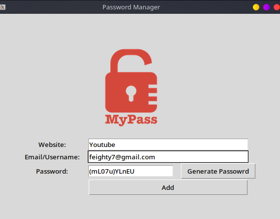

# Password Manager



A desktop GUI application built with Python and Tkinter that generates strong passwords and stores them securely in a local JSON file.

## Features

- **Password Generator** — creates randomized passwords with 8–10 letters, 2–4 symbols, and 2–4 numbers, shuffled for unpredictability
- **Auto-copy** — generated password is automatically copied to the clipboard via `pyperclip`
- **Save credentials** — stores website, email/username, and password to `data.json`
- **Search** — look up saved credentials by website name

## Requirements

- Python 3.x
- `pyperclip`

Install the dependency:

```bash
pip install pyperclip
```

## Usage

1. Place `logo.png` in the same directory as `main.py`
2. Run the app:

```bash
python main.py
```

3. Enter a website and email, then either type a password or click **Generate Password**
4. Click **Add** to save, or **Search** to retrieve existing credentials

## Data Storage

Credentials are saved to `data.json` in the project directory in this format:

```json
{
  "example.com": {
    "email": "user@example.com",
    "password": "aB3!xZ9#"
  }
}
```

## Project Structure

```
Day 29/
├── main.py       # Application entry point
├── logo.png      # App logo displayed in the UI
├── data.json     # Auto-created on first save
└── README.md
```